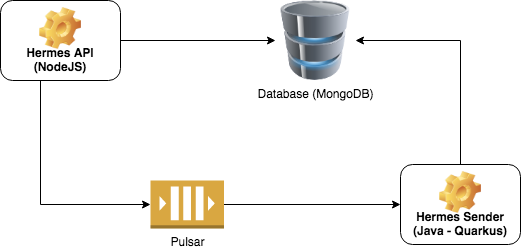

# hermes

O Hermes é um sistema de envio de notificações baseado em eventos.
A idéia é que uma requisição de envio de notificação seja feita na API que criará o modelo de mensagem e enviará um evento para o consumidor que enviará a mensagem para cada endereço de e-mail requisitado.

