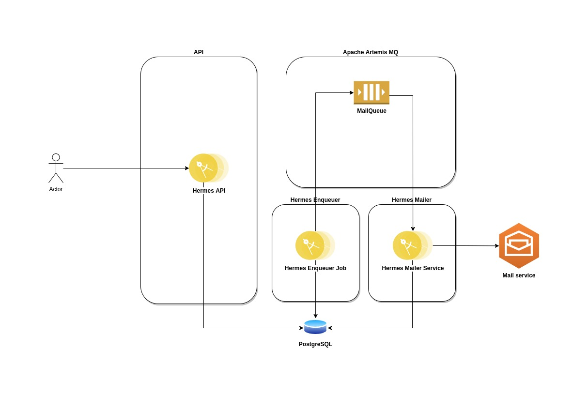

# hermes

O Hermes é um sistema de envio de notificações baseado em eventos.
A idéia é que uma requisição de envio de notificação seja feita na API que criará o modelo de mensagem e enviará um evento para o consumidor que enviará a mensagem para cada endereço de e-mail requisitado.



A idéia é a requisição chegar através do Hermes API onde será armazenada em um banco de dados (PostgreSQL).
Um job irá rodar de tempo em tempo definido na classe `br.com.saulocn.hermes.mailer.batch.MailEnqueuerJob` do Hermes Mailer através da anotação `@Scheduled(every = "2m")`, onde representa que o job será executado a cada 2 minutos. Este job é responsável por ler todas os destinatários de e-mails da tabela `hermes.recipient` que não foram processados (flag `recipient_processed`) e, colocar na fila JMS `jms.queue.MailQueue`.

Cada uma dessas mensagens será processada pelo método `br.com.saulocn.hermes.mailer.service.MessageService#mailConsumer` que obterá a mensagem que deverá ser enviada e enviará ao destinatário. Caso haja qualquer falha, a mensagem retornará para a fila para ser processada numa retentativa.

A fila é programada para ter 10 retentativas a cada 2 minutos:

```
<max-delivery-attempts>10</max-delivery-attempts>
<redelivery-delay>120000</redelivery-delay>
```

Foi implementado um job de processamento em lote para que possa reprocessar e-mails não enviados há 10 minutos na classe:

```
br.com.saulocn.hermes.mailer.batch.fallback.MailFallbackJob
```


## Testes

Foi realizado um teste com o mock de envio de e-mail e foi possível o envio de 24435 em 24 minutos conforme os logs abaixo:

```
hermes-api_1  | 2022-06-03 02:21:23,020 
mailer_1      | 2022-06-03 02:45:29,562 
```

## Como iniciar

É possível inicializar o sistema com o docker-compose através do comando
```
make run-compose
```
Neste comando, os sistemas em java são empacotados e os containers são construídos (`build`) e após isso é executado.

É possível inicializar cada um dos serviços.

### PostgreSQL

Para inicializar o banco de dados, basta executar o comando documentado nos Makefiles:

```
make run-db
```

### Apache Artemis MQ

Para inicializar o serviço de filas, basta executar o comando documentado nos Makefiles:

```
make run-mq
```


### Hermes API

Para inicializar o serviço da API, basta executar o comando documentado nos Makefiles:

```
make run-api
```


### Hermes Mailer

Para inicializar o serviço de enviador de processamento em lote e enviador de e-mail, basta executar o comando documentado nos Makefiles:

```
make run-mailer
```


### Todos os serviços

Para inicializar todos os serviços, basta executar o comando no Makefile:

```
make run-all
```


## Referências:
https://quarkus.io/guides/rest-json
https://quarkus.io/guides/datasource
https://quarkus.io/guides/amqp
https://smallrye.io/smallrye-reactive-messaging/smallrye-reactive-messaging/3.4/amqp/amqp.html
https://github.com/quarkiverse/quarkus-jberet
https://activemq.apache.org/components/artemis/documentation/latest/
https://hub.docker.com/_/postgres

Imagem do Artemis:
https://github.com/saulocn/dockerlands