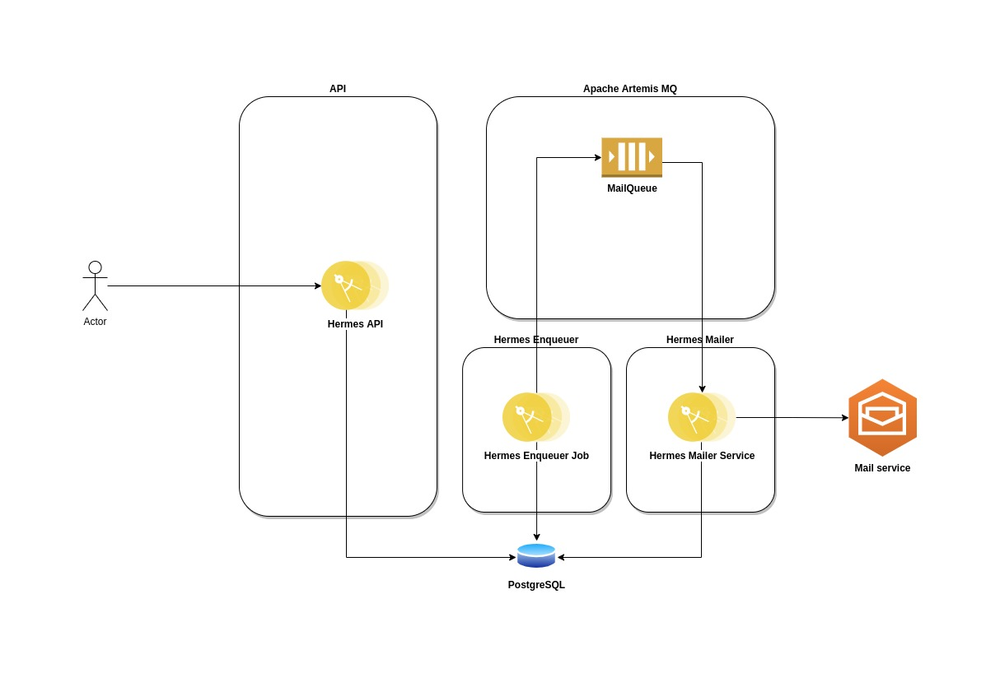

# hermes

O Hermes é um sistema de envio de notificações baseado em eventos.
A idéia é que uma requisição de envio de notificação seja feita na API que criará o modelo de mensagem e enviará um evento para o consumidor que enviará a mensagem para cada endereço de e-mail requisitado.



A idéia é a requisição chegar através do Hermes API onde será armazenada em um banco de dados (PostgreSQL).
Um job roda periodicamente, definido em `br.com.saulocn.hermes.enqueuer.batch.enqueuer.MailEnqueuerJob` (no Hermes Enqueuer) pela anotação `@Scheduled(every = "30s")`. Este job é responsável por ler todas os destinatários de e-mails da tabela `hermes.recipient` que não foram processados (flag `recipient_processed`) e, colocar na fila JMS `jms.queue.MailQueue`.

Cada uma dessas mensagens será processada pelo método `br.com.saulocn.hermes.mailer.service.MessageService#mailConsumer` que obterá a mensagem que deverá ser enviada e enviará ao destinatário. Caso haja qualquer falha, a mensagem retornará para a fila para ser processada numa retentativa.

A fila é programada para ter 10 retentativas a cada 2 minutos:

```
<max-delivery-attempts>10</max-delivery-attempts>
<redelivery-delay>120000</redelivery-delay>
```

Foi implementado um job de processamento em lote para reprocessar e-mails não enviados há 10 minutos:

```
br.com.saulocn.hermes.enqueuer.batch.fallback.MailFallbackJob
```

Os dois jobs também podem ser disparados na hora pela tela ou por `POST /jobs/{enqueue,fallback}` no enqueuer.


## Como iniciar

### Requisitos

Os três módulos Java rodam em **Quarkus 3.38.2** e exigem **JDK 17 ou superior** (foram validados no JDK 25). O build usa o wrapper `./mvnw` de cada módulo — não é preciso ter Maven instalado. A tela precisa de Node 22 para build local, mas o `docker compose` a constrói sozinho.

O `application.properties` de cada módulo é versionado: todo valor nele vem de variável de ambiente com default, sem segredo. Um clone limpo roda `docker compose up` direto. (Ele já foi gitignored, o que obrigava a copiar o `.sample` na mão e quebrava build em máquina nova.)

### Docker Compose

É possível inicializar o sistema com o docker-compose através do comando
```
make run-compose
```
Neste comando, os sistemas em java são empacotados e os containers são construídos (`build`) e após isso é executado.

É possível inicializar cada um dos serviços.

## Escolhendo o broker

O Hermes suporta dois brokers de mensagens: **Apache Artemis** (padrão) e **RabbitMQ**. Eles são configurados através de perfis no Docker Compose.

### Artemis (padrão)

Para inicializar o sistema com Artemis, execute:

```
make run-compose
```

Ou diretamente com Docker Compose:

```
docker compose up --build
```

O padrão é Artemis, definido por `COMPOSE_PROFILES=artemis` no arquivo `.env` do repositório.

### RabbitMQ

Para inicializar o sistema com RabbitMQ, execute:

```
make run-compose-rabbit
```

Ou diretamente com Docker Compose:

```
docker compose --profile rabbit up --build
```

> **Atenção ao derrubar.** `docker compose down` só alcança os serviços do profile ativo. Depois de rodar o profile `rabbit`, um `docker compose down` puro deixa os containers dele de pé — e o `enqueuer-rabbit` continua lendo o mesmo Postgres, o que corrompe qualquer medição ou teste seguinte. Para derrubar tudo:
>
> ```
> COMPOSE_PROFILES=artemis,rabbit docker compose down -v --remove-orphans
> ```

### Comparação de funcionalidades

| Aspecto | Artemis | RabbitMQ |
|---------|---------|----------|
| Fila | `jms.queue.MailQueue` | `MailQueue` (quorum queue) |
| Tentativas de entrega | `max-delivery-attempts=10` | `x-delivery-limit=10` |
| DLQ | auto-create-dead-letter-resources | exchange `hermes.dlx` -> fila `MailQueueDLQ` |
| Console | http://localhost:8161 | http://localhost:15672 |

Login em ambos os consoles: `hermes` / `pass_hermes`.

### Observação importante sobre tentativas de entrega

> **Artemis** usa `redelivery-delay=120000` (2 minutos entre tentativas). **RabbitMQ** não tem equivalente para quorum queues — as 10 tentativas acontecem sem espaçamento. As tentativas e a DLQ são preservadas; o intervalo não.

### AMQP 1.0 e variáveis de ambiente

A aplicação se comunica via AMQP 1.0 com ambos os brokers (RabbitMQ 4.x suporta AMQP 1.0 nativamente), portanto não há mudanças na biblioteca cliente. O endereço da fila é controlado pela variável de ambiente `MQ_MAIL_ADDRESS`.

## Testes

```
cd hermes-mailer && ./mvnw verify     # ITs de broker
cd hermes-enqueuer && ./mvnw verify   # ITs de batch
```

Classes `*IT` rodam no failsafe (`mvn verify`) porque precisam de Docker; `mvn test` continua rápido e sem Docker.

| Teste | Cobre |
|-------|-------|
| `MailConsumerArtemisIT` | consumo via AMQP 1.0 contra Artemis real, no address padrão `jms.queue.MailQueue` |
| `MailConsumerRabbitIT` | o mesmo contrato contra RabbitMQ 4.x real, em `/queues/MailQueue` |
| `MailEnqueuerJobIT` | pump DB→fila: publica os não processados e marca `recipient_processed` |
| `MailFallbackJobIT` | rede de segurança: republica só o que está fora da janela de 10 minutos |
| `MailWriterAckIT` | invariante central: com o broker recusando a publicação, nenhum destinatário é marcado como processado |

Os dois ITs de broker herdam de `AbstractMailConsumerIT` e sobem o container com o **mesmo** `artemis/broker.xml` / `rabbit/definitions.json` que o compose usa — é isso que trava a paridade de comportamento entre os brokers. Os testes de batch usam o connector in-memory do SmallRye e não precisam de broker.

## Inicializando serviços individualmente

Além do compose, dá para subir cada serviço como container avulso (`make run-all` com Artemis, `make run-all-rabbit` com RabbitMQ). Eles entram numa rede própria, `hermes-net`, criada sob demanda.

> Esse caminho usava `--network host` e `localhost` nos `sample.env`. Não funcionava no Docker Desktop (macOS/Windows), onde o host network fica dentro da VM: as portas dos módulos Java não chegavam nem ao browser nem aos outros containers — `curl localhost:8080` dava conexão recusada, e o `hermes-web` nem subia (`host not found in upstream "hermes-api"`). Com rede definida pelo usuário há DNS por nome de container e as portas publicam normalmente, então os `sample.env` agora apontam para `hermes-pg`, `hermes-cache` e `hermes-artemis` em vez de `localhost`. Se você tem um `.env` local herdado, atualize-o.

`make run-all-rabbit` sobrepõe o que muda entre brokers via `-e` (que vence o `--env-file`): `MQ_HOST`, `MQ_MAIL_ADDRESS` para os apps, e `BROKER_KIND`/`BROKER_HOST`/`BROKER_MGMT_PORT` para o `hermes-api` ler a profundidade de fila. Sem o `MQ_MAIL_ADDRESS` os apps usariam `jms.queue.MailQueue`, que não existe no RabbitMQ.


### PostgreSQL

Para inicializar o banco de dados, basta executar o comando documentado nos Makefiles:

```
make run-db
```

### Apache Artemis MQ

Para inicializar o serviço de filas, basta executar o comando documentado nos Makefiles:

```
make run-mq
```

### RabbitMQ

Alternativa ao Artemis, com a mesma finalidade:

```
make run-rabbit
```


### Hermes API

Para inicializar o serviço da API, basta executar o comando documentado nos Makefiles:

```
make run-api
```


### Hermes Mailer

Para inicializar o serviço de enviador de processamento em lote e enviador de e-mail, basta executar o comando documentado nos Makefiles:

```
make run-mailer
```


### Todos os serviços

Para inicializar todos os serviços, basta executar o comando no Makefile:

```
make run-all
```


## Console de operação

A tela fica em **http://localhost:8090** e sobe junto com qualquer um dos dois profiles (`hermes-web`, sem profile próprio). São quatro páginas:

| Página | O que faz |
|---|---|
| Dashboard | Contagens por estado, profundidade da fila e da DLQ, broker ativo, gráfico de entregas por minuto. Auto-refresh selecionável (desligado / 2s / 5s / 15s) |
| Compor | Envio de mensagem com lista de destinatários — o que antes só dava para fazer via `curl` |
| Histórico | Mensagens paginadas com busca e progresso de entrega por mensagem |
| Admin | Dispara os jobs de enqueue e fallback na hora, e reprocessa destinatário individual |

Os três estados que a tela mostra vêm dos dois booleanos que o schema carrega:

- **pendente** — `processed=false, sent=false`: ainda não publicado no broker.
- **em voo** — `processed=true, sent=false`: publicado, ainda não entregue.
- **entregue** — `sent=true`.

> **Sem autenticação.** A tela expõe operações administrativas (disparo de job, reprocessamento) sem nenhuma barreira. Não publique fora de rede confiável.

A SPA é React + Vite servida por nginx, que também faz proxy de `/api` para o `hermes-api` — por isso não há configuração de CORS em lugar nenhum. No profile rabbit o `hermes-api-rabbit` responde pelo alias de rede `hermes-api`, para o nginx não precisar saber qual profile está ativo.

### API de administração

Endpoints em `hermes-api`, consumidos pela tela via `/api/...`:

```
GET  /admin/stats                      contagens por estado + mensagem mais antiga sem entregar
GET  /admin/throughput?minutes=60      entregues por minuto
GET  /admin/broker                     broker ativo + profundidade de MailQueue e DLQ
GET  /admin/messages?page&size&q       histórico paginado
GET  /admin/recipients?email&state     busca de destinatário
POST /admin/recipients/{id}/retry      devolve o destinatário para a fila
POST /admin/jobs/{enqueue,fallback}    dispara o job na hora (encaminha para o enqueuer)
```

A profundidade de fila é best-effort: as APIs de gestão dos dois brokers estão fora do controle deste repo, então falha devolve `queueDepth: null` com o motivo em `error`, e a tela mostra "indisponível" em vez de quebrar. No Artemis o MBean é localizado por `search` com `broker=*` — o nome do broker na imagem base é `0.0.0.0`, não `hermes`, e fixar isso quebraria numa troca de imagem.

O `hermes-enqueuer` expõe `POST /jobs/{enqueue,fallback}` e `GET /jobs/{executionId}` na porta **8082**. Antes ele não tinha endpoint nenhum, apesar de já subir um servidor HTTP.

## Capacidade

Números medidos **com os limites de recurso do `docker-compose.yml` aplicados** (confirmados via `docker inspect`), com `MAIL_MOCK=true` — medem API → Postgres → enqueuer → broker → mailer, e **não** o SMTP real.

### Limites por container

| Serviço | CPU | Memória |
|---|---|---|
| `hermes-api`, `enqueuer`, `mailer` | 1,0 | 1024 MB |
| `hermes-db`, `hermes-cache`, `hermes-mq` / `hermes-rabbit`, `hermes-web` | 0,5 | 512 MB |

### Evolução medida (10.000 destinatários, 100 mensagens × 100)

Cada etapa isola o efeito de uma mudança:

| Etapa | Artemis | RabbitMQ | Não entregues |
|---|---|---|---|
| 1. Baseline (Quarkus 3.36.2) | 256/s | 665/s | 4 e 20 |
| 2. Quarkus 3.38.2 | 263/s | 832/s | 12 e 17 |
| 3. Ack do broker + `@OnOverflow` + fim do lost update | 667/s | 667/s | **0 e 0** |
| 4. Índices + pool 8 | 769/s | 667/s | 0 e 0 |
| 5. JVM tunada + consumo idempotente | **769/s** | **769/s** | **0 e 0** |

**Artemis ficou ~3× mais rápido** entre o baseline e hoje. O salto está na etapa 3: o que dominava antes era o estouro do buffer do emitter derrubando o job de batch no meio do lote.

Duas ressalvas para ler a tabela com honestidade:

- **A janela de dreno é de 13–15s e o benchmark faz polling a cada 2s**, ou seja ±15% de resolução. A diferença entre 667/s e 769/s é *um intervalo de polling*, não sinal.
- **Neste tamanho o tuning de JVM não aparece.** 10 mil mensagens drenam antes de a pressão de GC se acumular, então a etapa 5 mede igual à 4. O efeito real está na tabela abaixo.

### Em escala (100.000 destinatários)

| | Artemis | RabbitMQ |
|---|---|---|
| Vazão sustentada | **1.190/s** | **1.429/s** |
| Janela de dreno | 84s | 77s |
| Não entregues | 0 | 0 |
| Memória do mailer | 451 MiB | 536 MiB / 1 GiB |

Quase o dobro do que o teste de 10 mil sugere — naquele tamanho o número é diluído pela rampa e pela granularidade do polling. Com uma janela de ~80s a medição fica bem mais confiável.

Ingestão medida à parte com k6 (1 VU, cenário `smoke`): **6.748 destinatários/s**. A API não é o gargalo; ela só insere no Postgres.

### JVM

Os defaults da JVM em container pequeno são hostis, e isso derrubou o mailer drenando um backlog de 1,1 milhão de mensagens (`Terminating due to java.lang.OutOfMemoryError`). Medido dentro do container, antes de qualquer flag:

```
MaxHeapSize      = 268435456  (256 MB)   ergonomic
MaxRAMPercentage = 25.0                  default
UseSerialGC      = true                  ergonomic
nproc            = 10   ← mas o limite do compose é cpus: '1'
```

Três armadilhas somadas:

1. **O heap era 25% do container.** 1 GiB de limite virou 256 MB de heap. Os outros 768 MB nunca seriam usados.
2. **SerialGC por ergonomia.** Abaixo de 1792 MB a JVM escolhe o coletor serial; suas paradas completas travavam a única CPU disponível.
3. **`nproc` retorna 10.** `cpus: '1'` no compose é *quota* de CPU, não *cpuset* — a JVM e o Vert.x dimensionaram pools para 10 processadores que o processo nunca recebe.

Flags aplicadas (em `docker-compose.yml` e nos `sample.env`):

```
-XX:MaxRAMPercentage=70 -XX:+UseG1GC -XX:ActiveProcessorCount=1
-XX:+HeapDumpOnOutOfMemoryError -XX:HeapDumpPath=/tmp
```

Efeito medido na mesma janela de 90s, contra o mesmo backlog:

| | Antes | Depois |
|---|---|---|
| Vazão | 34/s | **1.520/s** |
| CPU | 99,5% | 54,1% |
| Heap máximo | 256 MB | 752 MB |
| Coletor | SerialGC | G1 |
| Memória do container | 444 MiB | 506 MiB / 1 GiB, estável |

O `-XX:+ExitOnOutOfMemoryError` já vinha da imagem base — é por isso que o container morre com exit 3 em vez de ficar meio vivo. Com `restart: always` no compose, ele volta sozinho; no caminho avulso, não.

> **Cuidado com aspas.** No `docker-compose.yml` o valor é YAML e as aspas são removidas na leitura. Nos `sample.env` **não**: `--env-file` do Docker não faz parsing de shell, então `JAVA_OPTIONS="..."` entrega o valor *com* as aspas e o `java` trata tudo como nome de classe (`Could not find or load main class "-Dquarkus.http.host=0.0.0.0`). Nos `.env` a linha vai sem aspas.

### Estimativa de volume

- **Tempo até a primeira entrega é cadência, não capacidade**: o `MailEnqueuerJob` roda a cada 30s, então tudo espera ~15s em média mesmo com o sistema vazio. A tela permite pular essa espera com o disparo manual.
- **Número de planejamento conservador: ~1.100 destinatários/s (~4 milhões/hora)** — o pior dos dois brokers na medição de 100 mil, que é a mais confiável. Ressalva: medido numa janela de ~80s, **não validado em regime de horas**; use o cenário `soak` do k6 para isso.
- Há um teto explícito em `MailReader.MAX_RECIPIENTS_PER_RUN` (30.000). Ele divide pelo intervalo do scheduler e vira vazão máxima: 30.000 ÷ 30s ≈ 1.000/s — **já é o gargalo nesse patamar**. Se precisar de mais, suba o cap ou reduza o intervalo do scheduler; com 1.000 a medição deu 38/s.

### Backlog grande

Um teste de carga acumulou 1,1 milhão de mensagens na fila e expôs o que não aparece em 10 mil:

- **Nada se perde.** Todas ficam no broker; `inFlight` alto significa "publicado, aguardando consumo", não perda. A DLQ ficou zerada o tempo todo.
- **O consumidor é o gargalo, e ele pode morrer.** O mailer estourou o heap e saiu com exit 3. Ver a seção JVM — os defaults davam 256 MB de heap e SerialGC.
- **O `MailFallbackJob` gera duplicatas quando o consumo atrasa.** Ele republica tudo com `sent = false` a cada 10 minutos, sem saber que aquilo já está enfileirado: 174 mil cópias em ~68 minutos. Por isso o consumo é idempotente (ver abaixo) — a duplicata é consumida, reconhecida e descartada sem enviar e-mail. Foram 16.615 descartes observados num único dreno.

### O que foi corrigido

Sob carga, uma fração das linhas ficava `processed=true, sent=false`. Eram **duas** causas distintas:

1. **Publicação sem confirmação.** `MailWriter` descartava o `CompletionStage` devolvido por `Emitter.send(...)` e marcava `processed=true` na linha seguinte, sem saber se o broker aceitou. Somado a um `Emitter` sem `@OnOverflow` (buffer default de 128, menor que o chunk de 100 sob concorrência), o estouro derrubava o job com `SRMSG00034`. Hoje o lote inteiro é publicado, espera-se o ack de todos com timeout, e só então o estado é gravado — falha reverte o chunk e o próximo ciclo tenta de novo.

2. **Lost update.** O `MailReader` carrega as entidades no início do chunk; o mailer marcava `sent=true` durante a janela de publicação; e o `entityManager.merge()` do writer regravava a linha inteira a partir do cache de primeiro nível, **zerando `sent` de volta**. O e-mail tinha sido enviado e o banco dizia que não — e o job de fallback então mandava de novo, gerando **duplicata**. Hoje os dois lados usam update direcionado (`update Recipient set processed = ...`), que toca uma coluna só.

3. **Envio duplicado.** O mailer checava `if (!recipient.isSent())` e só então gravava. Duas cópias da mesma mensagem consumidas em paralelo pelos 30 threads do worker pool podiam passar as duas pela checagem antes de qualquer uma commitar — dois e-mails para a mesma pessoa. Hoje o claim é atômico:

   ```sql
   update Recipient r set r.sent = true where r.id = :id and r.sent = false
   ```

   Zero linhas atualizadas significa que outra cópia já entregou: o consumidor loga, retorna e o retorno normal **dá ack**, tirando a duplicata da fila em vez de deixá-la redelivering. O claim vem *antes* do envio de propósito — se o envio falhar, a transação reverte o claim junto e a mensagem é reentregue.

O `MailFallbackJob` continua sendo a rede de segurança para o que escapar, com latência de recuperação de até ~20 minutos (até 10 min para entrar na janela + até 10 min para o próximo tick).

### Reproduzindo

```
./bench/bench.sh artemis 100 100                        # 10k destinatários no Artemis
COMPOSE_PROFILES=rabbit ./bench/bench.sh rabbit 100 100  # o mesmo no RabbitMQ
```

O script separa **cadência** (tempo até a primeira entrega) de **vazão sustentada** (destinatários/s enquanto o pipeline se move) — os dois não são a mesma coisa.

Teste de carga da ingestão com k6 (cenários `smoke`, `ramp`, `soak`, `burst`):

```
k6 run bench/load-test.js
k6 run -e SCENARIO=soak -e RECIPIENTS=200 bench/load-test.js
```

Sem k6 instalado, use a imagem oficial:

```
docker run --rm -i -v "$PWD/bench:/bench" \
  -e BASE_URL=http://host.docker.internal:8080 -e SCENARIO=ramp \
  grafana/k6 run /bench/load-test.js
```

> Medição histórica (2022, antes do upgrade para Quarkus 3): 24.435 e-mails em 24 minutos (~17/s). Mantida como referência — o cenário e a máquina eram outros.

## Referências:
https://quarkus.io/guides/rest-json
https://quarkus.io/guides/datasource
https://quarkus.io/guides/amqp
https://smallrye.io/smallrye-reactive-messaging/smallrye-reactive-messaging/3.4/amqp/amqp.html
https://github.com/quarkiverse/quarkus-jberet
https://activemq.apache.org/components/artemis/documentation/latest/
https://hub.docker.com/_/postgres

Imagem do Artemis:
https://github.com/saulocn/dockerlands
