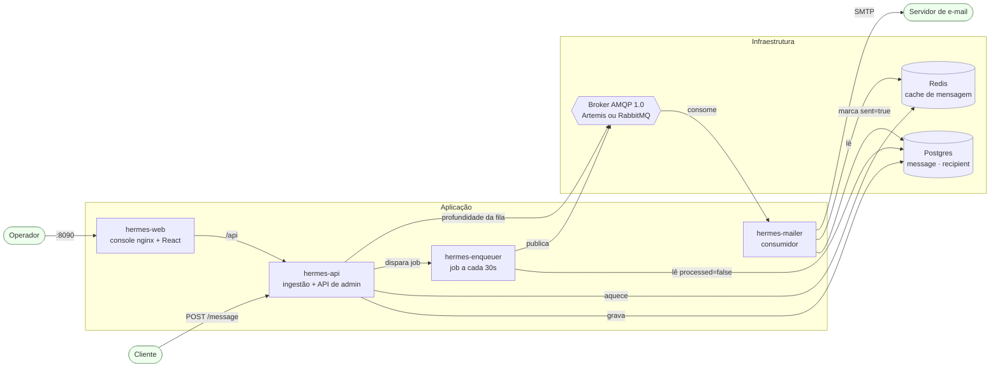

# hermes

O Hermes envia notificações por e-mail em lote. Uma requisição chega na API, que grava a mensagem e seus destinatários no Postgres; um job periódico publica cada destinatário numa fila; um consumidor lê da fila e envia o e-mail.


```mermaid
flowchart LR
    U([Cliente]) -->|POST /message| API
    OP([Operador]) -->|:8090| WEB

    subgraph app[Aplicação]
        API[hermes-api<br/>ingestão + API de admin]
        ENQ[hermes-enqueuer<br/>job a cada 30s]
        MAI[hermes-mailer<br/>consumidor]
        WEB[hermes-web<br/>console nginx + React]
    end

    subgraph infra[Infraestrutura]
        DB[(Postgres<br/>message · recipient)]
        CACHE[(Redis<br/>cache de mensagem)]
        BROKER{{Broker AMQP 1.0<br/>Artemis ou RabbitMQ}}
    end

    API -->|grava| DB
    API -->|aquece| CACHE
    ENQ -->|lê processed=false| DB
    ENQ -->|publica| BROKER
    BROKER -->|consome| MAI
    MAI -->|marca sent=true| DB
    MAI -->|lê| CACHE
    MAI -->|SMTP| MAIL([Servidor de e-mail])
    WEB -->|/api| API
    API -->|dispara job| ENQ
    API -->|profundidade da fila| BROKER

    classDef store fill:#eef,stroke:#88a
    classDef ext fill:#efe,stroke:#8a8
    class DB,CACHE store
    class MAIL,U,OP ext
```

O estado de cada destinatário sai de dois booleanos e um contador na tabela `hermes.recipient`. São quatro estados, e eles **particionam** a tabela: toda linha está em exatamente um, e as quatro contagens do painel somam o total.

| Estado | `processed` | `sent` | `attempts` | Significado |
|---|---|---|---|---|
| Pendente | `false` | `false` | — | Ainda não publicado no broker |
| Em trânsito | `true` | `false` | `= 0` | Publicado, aguardando consumo |
| Falhando | `true` | `false` | `> 0` | Publicado, e algum envio já lançou |
| Entregue | `true` | `true` | — | E-mail enviado |

"Falhando" existe porque um envio que lança faz rollback do claim e a linha volta a `processed=true, sent=false` — exatamente o que uma mensagem só aguardando na fila parece. Sem o contador, uma mensagem presa em retentativa e uma apenas enfileirada eram o mesmo número no painel, para sempre.

O contador é gravado em transação própria, porque o rollback que devolve a mensagem à fila desfaria qualquer coisa escrita na transação da entrega — e **fora** dela, depois que o rollback já soltou o lock da linha. Uma transação nova atualizando a linha que a transação suspensa ainda trava espera por um lock que só a própria thread pode liberar; o Postgres não vê ciclo, porque um dos lados é código de aplicação. É por isso que o consumidor (`MailConsumer`) e a entrega (`MessageService#deliver`) são módulos separados: a ordem "entrega commita ou aborta, depois conta" é o que essa separação expressa. Quem reprocessa pelo console zera o contador junto, porque as falhas antigas deixaram de descrever a linha.

Do lado da api, os quatro estados vivem em `RecipientState`: o nome na URL e o predicado SQL viajam juntos, e a query de contagem e a de filtro derivam os dois do enum. Foi a falta disso que deixou `failing` entrar no painel como contagem sem existir como filtro — o console mostrava um número que não abria.

Isso não é "declarado uma vez". O console repete a lista em `RECIPIENT_STATES` (nome + rótulo) e **reimplementa o predicado** em `Admin.tsx#recipientState`, para decidir o badge de cada linha sem uma segunda ida ao servidor. Somando o record `Stats`, a chamada posicional que o constrói e os cards do painel, um quinto estado ainda toca sete lugares em duas linguagens. O que o enum resolveu foi a api discordar de si mesma.

**Fluxo.** `JobLauncher#enqueueTick()` roda a cada 30s (configurável), lê os destinatários com `processed = false` e publica cada um. `br.com.saulocn.hermes.mailer.service.MailConsumer#consume` tira da fila, `MessageService#deliver` reivindica a linha, envia e marca `sent = true`. Uma falha no envio devolve a mensagem à fila para nova tentativa.

**Rede de segurança.** `JobLauncher#fallbackTick()` roda a cada 10 minutos e republica o que continua `sent = false` há mais de 10 minutos. Isso recupera qualquer coisa que se perca entre a publicação e a entrega, ao custo de gerar duplicatas quando o consumo está atrasado — por isso o consumo é idempotente (ver "O que foi corrigido").

**Retentativas no broker:** 10 tentativas. No Artemis com 2 minutos entre elas (`redelivery-delay`), no RabbitMQ sem espaçamento (não há equivalente para quorum queues).

Os dois jobs também podem ser disparados na hora pelo console ou por `POST /jobs/{enqueue,fallback}` no enqueuer.

## Como iniciar

### Requisitos

Os três módulos Java rodam em **Quarkus 3.38.2** e exigem **JDK 17 ou superior** (foram validados no JDK 25). O build usa o wrapper `./mvnw` de cada módulo — não é preciso ter Maven instalado. A tela precisa de Node 22 para build local, mas o `docker compose` a constrói sozinho.

O `application.properties` de cada módulo é versionado: todo valor nele vem de variável de ambiente com default, sem segredo. Um clone limpo roda `docker compose up` direto. (Ele já foi gitignored, o que obrigava a copiar um `application.sample.properties` na mão e quebrava build em máquina nova. Os `.sample` foram removidos: com o arquivo real versionado, eram três cópias byte a byte idênticas que nada obrigava a permanecerem iguais.)

### Docker Compose

É possível inicializar o sistema com o docker-compose através do comando
```
make run-compose
```
Neste comando, os sistemas em java são empacotados e os containers são construídos (`build`) e após isso é executado.

É possível inicializar cada um dos serviços.

## Escolhendo o broker

O Hermes suporta dois brokers de mensagens: **Apache Artemis** (padrão) e **RabbitMQ**. Eles são configurados através de perfis no Docker Compose.

### Artemis (padrão)

Para inicializar o sistema com Artemis, execute:

```
make run-compose
```

Ou diretamente com Docker Compose:

```
docker compose up --build
```

O padrão é Artemis, definido por `COMPOSE_PROFILES=artemis` no arquivo `.env` do repositório.

### RabbitMQ

Para inicializar o sistema com RabbitMQ, execute:

```
make run-compose-rabbit
```

Ou diretamente com Docker Compose:

```
docker compose --profile rabbit up --build
```

> **Atenção ao derrubar.** `docker compose down` só alcança os serviços do profile ativo. Depois de rodar o profile `rabbit`, um `docker compose down` puro deixa os containers dele de pé — e o `enqueuer-rabbit` continua lendo o mesmo Postgres, o que corrompe qualquer medição ou teste seguinte. Para derrubar tudo:
>
> ```
> COMPOSE_PROFILES=artemis,rabbit docker compose down -v --remove-orphans
> ```

### Comparação de funcionalidades

| Aspecto | Artemis | RabbitMQ |
|---------|---------|----------|
| Fila | `jms.queue.MailQueue` | `MailQueue` (quorum queue) |
| Tentativas de entrega | `max-delivery-attempts=10` | `x-delivery-limit=10` |
| DLQ | auto-create-dead-letter-resources | exchange `hermes.dlx` -> fila `MailQueueDLQ` |
| Console | http://localhost:8161 | http://localhost:15672 |

Login em ambos os consoles: `hermes` / `pass_hermes`.

### Observação importante sobre tentativas de entrega

> **Artemis** usa `redelivery-delay=120000` (2 minutos entre tentativas). **RabbitMQ** não tem equivalente para quorum queues — as 10 tentativas acontecem sem espaçamento. As tentativas e a DLQ são preservadas; o intervalo não.

### AMQP 1.0 e variáveis de ambiente

A aplicação se comunica via AMQP 1.0 com ambos os brokers (RabbitMQ 4.x suporta AMQP 1.0 nativamente), portanto não há mudanças na biblioteca cliente. O endereço da fila é controlado pela variável de ambiente `MQ_MAIL_ADDRESS`.

## Testes

```
cd hermes-api && ./mvnw verify        # ITs do admin e do message
cd hermes-enqueuer && ./mvnw verify   # ITs de batch
cd hermes-mailer && ./mvnw verify     # ITs de broker
make test                             # Tudo acima, mais testes web (vitest)
```

Classes `*IT` rodam no failsafe (`mvn verify`) porque precisam de Docker; `mvn test` continua rápido e sem Docker.

| Teste | Cobre |
|-------|-------|
| `MailConsumerArtemisIT` | consumo via AMQP 1.0 contra Artemis real, no address padrão `jms.queue.MailQueue` |
| `MailConsumerRabbitIT` | o mesmo contrato contra RabbitMQ 4.x real, em `/queues/MailQueue` |
| `MailEnqueuerJobIT` | `JobLauncher#enqueueTick()`: pump DB→fila, publica os não processados e marca `recipient_processed` |
| `MailFallbackJobIT` | `JobLauncher#fallbackTick()`: rede de segurança, republica só o que está fora da janela de 10 minutos |
| `MailWriterAckIT` | invariante central: com o broker recusando a publicação, nenhum destinatário é marcado como processado |
| `DeliveryFailureIT` | um envio que lança conta a tentativa **e** devolve o claim — sem esperar o timeout de transação |
| `AdminContractIT` | contrato do console, incluindo `state=failing` listável, estado desconhecido como 400 e reprocessamento zerando o contador |
| `BrokerAdminTest` | os dois adapters de broker, sem container |

Os dois ITs de broker herdam de `AbstractMailConsumerIT` e sobem o container com o **mesmo** `artemis/broker.xml` / `rabbit/definitions.json` que o compose usa — é isso que trava a paridade de comportamento entre os brokers. Os testes de batch usam o connector in-memory do SmallRye e não precisam de broker.

O `DeliveryFailureIT` também usa o connector in-memory: o que ele verifica é a ordem entre a transação de entrega e o contador de falha, e AMQP não participa disso. O orçamento de 10s do teste não é medida de performance — a segunda transação falha ao adquirir conexão do pool (timeout de 5s do Agroal em um pool de size 2), então o teste é determinístico, não uma corrida. A primeira transação segura uma conexão enquanto a segunda espera por outra, o que faz o erro acontecer sistematicamente antes do timeout de transação de 30s (a produção é 2s).

## Inicializando serviços individualmente

Além do compose, dá para subir cada serviço como container avulso (`make run-all` com Artemis, `make run-all-rabbit` com RabbitMQ). Eles entram numa rede própria, `hermes-net`, criada sob demanda.

> Esse caminho usava `--network host` e `localhost` nos `sample.env`. Não funcionava no Docker Desktop (macOS/Windows), onde o host network fica dentro da VM: as portas dos módulos Java não chegavam nem ao browser nem aos outros containers — `curl localhost:8080` dava conexão recusada, e o `hermes-web` nem subia (`host not found in upstream "hermes-api"`). Com rede definida pelo usuário há DNS por nome de container e as portas publicam normalmente, então os `sample.env` agora apontam para `hermes-pg`, `hermes-cache` e `hermes-artemis` em vez de `localhost`. Se você tem um `.env` local herdado, atualize-o.

`make run-all-rabbit` sobrepõe o que muda entre brokers via `-e` (que vence o `--env-file`): `MQ_HOST`, `MQ_MAIL_ADDRESS` para os apps, e `BROKER_KIND`/`BROKER_HOST`/`BROKER_MGMT_PORT` para o `hermes-api` ler a profundidade de fila. Sem o `MQ_MAIL_ADDRESS` os apps usariam `jms.queue.MailQueue`, que não existe no RabbitMQ.


### PostgreSQL

Para inicializar o banco de dados, basta executar o comando documentado nos Makefiles:

```
make run-db
```

### Apache Artemis MQ

Para inicializar o serviço de filas, basta executar o comando documentado nos Makefiles:

```
make run-mq
```

### RabbitMQ

Alternativa ao Artemis, com a mesma finalidade:

```
make run-rabbit
```


### Hermes API

Para inicializar o serviço da API, basta executar o comando documentado nos Makefiles:

```
make run-api
```


### Hermes Mailer

Para inicializar o serviço de enviador de processamento em lote e enviador de e-mail, basta executar o comando documentado nos Makefiles:

```
make run-mailer
```


### Todos os serviços

Para inicializar todos os serviços, basta executar o comando no Makefile:

```
make run-all
```


## Console de operação

A tela fica em **http://localhost:8090** e sobe junto com qualquer um dos dois profiles (`hermes-web`, sem profile próprio). São quatro páginas:

| Página | O que faz |
|---|---|
| Dashboard | Contagens por estado, profundidade da fila e da DLQ, broker ativo, gráfico de entregas por minuto. Auto-refresh selecionável (desligado / 2s / 5s / 15s) |
| Compor | Envio de mensagem com lista de destinatários — o que antes só dava para fazer via `curl` |
| Histórico | Mensagens paginadas com busca e progresso de entrega por mensagem |
| Admin | Dispara os jobs de enqueue e fallback na hora, e reprocessa destinatário individual |

Os estados que a tela mostra vêm dos dois booleanos `processed` e `sent` na tabela `recipient`, conforme a tabela na seção "Fluxo" — **pendente**, **em trânsito**, **falhando** (subconjunto de em trânsito, com `recipient_attempts > 0`) e **entregue**.

> **Sem autenticação.** A tela expõe operações administrativas (disparo de job, reprocessamento) sem nenhuma barreira. Não publique fora de rede confiável.

A SPA é React + Vite servida por nginx, que também faz proxy de `/api` para o `hermes-api` — por isso não há configuração de CORS em lugar nenhum. No profile rabbit o `hermes-api-rabbit` responde pelo alias de rede `hermes-api`, para o nginx não precisar saber qual profile está ativo.

### API de administração

Endpoints em `hermes-api`, consumidos pela tela via `/api/...`:

```
GET  /admin/stats                      contagens por estado + mensagem mais antiga sem entregar
GET  /admin/throughput?minutes=60      entregues por minuto
GET  /admin/broker                     broker ativo + profundidade de MailQueue e DLQ
GET  /admin/messages?page&size&q       histórico paginado
GET  /admin/recipients?email&state     busca de destinatário
POST /admin/recipients/{id}/retry      devolve o destinatário para a fila
POST /admin/jobs/{enqueue,fallback}    dispara o job na hora (encaminha para o enqueuer)
```

A profundidade de fila é best-effort: as APIs de gestão dos dois brokers estão fora do controle deste repo, então falha devolve `queueDepth: null` com o motivo em `error`, e a tela mostra "indisponível" em vez de quebrar. No Artemis o MBean é localizado por `search` com `broker=*` — o nome do broker na imagem base é `0.0.0.0`, não `hermes`, e fixar isso quebraria numa troca de imagem.

O `hermes-enqueuer` expõe `POST /jobs/{enqueue,fallback}` e `GET /jobs/{executionId}` na porta **8082**. Antes ele não tinha endpoint nenhum, apesar de já subir um servidor HTTP.

## Capacidade

Números medidos **com os limites de recurso do `docker-compose.yml` aplicados** (confirmados via `docker inspect`), com `MAIL_MOCK=true` — medem API → Postgres → enqueuer → broker → mailer, e **não** o SMTP real.

> **Estes números estão defasados e precisam ser refeitos.** Eles foram medidos com `jdbc.max-size=2` e 30 workers — com envio mockado, um envio custa microssegundos e o pool de 2 era o limitante real, o que por acaso dava ~1.450/s. Esse arranjo foi corrigido (ver "SMTP e transação" abaixo): pool e workers agora são o mesmo `MAIL_WORKERS`, default 10. Rode `make bench` de novo antes de citar qualquer número daqui.

### Limites por container

| Serviço | CPU | Memória |
|---|---|---|
| `hermes-api`, `enqueuer`, `mailer` | 1,0 | 1024 MB |
| `hermes-db`, `hermes-mq` / `hermes-rabbit` | 2,0 | 1024 MB |
| `hermes-cache`, `hermes-web` | 0,5 | 512 MB |

O banco e o broker ficam numa faixa maior que a tela e o cache porque são **compartilhados por todos os consumidores**: medidos a 0,5 CPU, o broker chegava a ~108% da própria quota e travava o sistema (ver abaixo).

### Onde está o gargalo

Medido componente a componente, com os outros isolados. Este é o resultado mais útil da seção, porque contradiz a intuição:

| Componente | Vazão isolada | CPU |
|---|---|---|
| **Enfileirador** | **~4.400/s** | ocioso após terminar |
| **Mailer** (1 réplica) | ~1.100–1.500/s | ~60% de 1 CPU |
| Entrega ponta a ponta | 1.200–1.450/s | — |

O enfileirador é **4× mais rápido** que o consumidor: aumentá-lo só encheria a fila mais depressa. Para medi-lo sozinho, pare o mailer, semeie destinatários e observe `recipient_processed` subir.

Escalar o mailer sozinho **também não resolve**:

> **Toda esta tabela usa a régua antiga**, a que superestima em ~80% (ver a seção de medições). As *comparações relativas* entre linhas continuam válidas — foram feitas com o mesmo erro em todas —, mas os valores absolutos não. Divida por ~1,8 para a ordem de grandeza real, ou refaça com `make bench`, que agora reporta o span verdadeiro.

| Configuração | Vazão (régua antiga) |
|---|---|
| 1 mailer, broker/banco 0,5 CPU | ~1.200/s |
| 2–3 mailers, broker/banco 0,5 CPU | ~1.160–1.560/s — **sem ganho** |
| 1 mailer, broker/banco 2 CPU | ~1.220–1.450/s — **sem ganho** |
| **2 mailers, broker/banco 2 CPU** | **2.308/s** |

Com o broker a 0,5 CPU, réplicas extras disputam um recurso saturado. Com o broker folgado mas um consumidor só, o consumidor limita. **As duas coisas precisam andar juntas** — é por isso que o compose separa a faixa de recursos do banco e do broker.

Para ir além de ~2.300/s: `docker compose up -d --scale mailer-rabbit=N` e acompanhar de quem é a CPU saturada a cada passo.

### Medições de referência (10.000 e 100.000 destinatários)

Com a configuração padrão do compose (1 mailer):

| | Artemis (corrigido) | Artemis (número antigo, inflado) |
|---|---|---|
| **100.000**, antes do reuso de Jsonb | ~1.163/s, span real de 86s | 1.449–2.128/s |
| **100.000**, depois | **~1.852/s**, span real de 54s | — |
| Não entregues | 0 | 0 |

> **Os números antigos estavam inflados, e por um defeito do próprio `bench.sh`.** Ele semeia todas as mensagens, **só então** liga o cronômetro, e divide *todas* as entregas pela janela que observou. Numa corrida de 100 mil a semeadura leva ~48s, e a entrega começa assim que o primeiro chunk é publicado — ou seja, dezenas de milhares são entregues antes do relógio começar. O `time to 1st delivery: 0s` que aparece na saída é o sintoma, não um elogio: significa que já havia entrega em curso na primeira leitura.
>
> Medido nas duas pontas na mesma corrida: janela amostrada 47s → 2.128/s, span real de `claimed_on` 86s → **1.163/s**. Superestimação de 83%. Numa segunda corrida, 59s → 1.695/s contra 104s → 962/s, 76%.
>
> O script agora reporta as duas linhas e diz qual acreditar. A linha boa usa `max(claimed_on) − min(claimed_on)`, que é a mesma aritmética de `/admin/rates → claimed.sustainedPerSecond` — console e benchmark passam a concordar sobre a mesma corrida, que era o ponto de existir o carimbo.

### Concorrência do mailer, medida

`MAIL_WORKERS` governa juntos o pool JDBC, o worker pool do consumidor e o pool SMTP. Medido em corridas de 100 mil, com o span real de `claimed_on`:

| `MAIL_WORKERS` | Vazão |
|---|---|
| 5 | 1.299/s |
| **10 (default)** | **1.852/s** |
| 30 | 1.316/s |

A curva tem pico em 10 e cai dos dois lados. Para cima não é falta de trabalho: com 1 CPU e 1 GiB, trinta threads geram troca de contexto e pressão de GC, e trinta conexões batem num banco que também tem CPU limitada. Para baixo é o oposto — cinco threads não cobrem a latência de ida e volta ao banco.

> Isto vale para **`MAIL_MOCK=true`**, onde o envio custa microssegundos. Com SMTP real o envio domina e o ponto ótimo muda: cada worker passa a segurar uma conexão de banco durante a ida e volta ao servidor de e-mail, e o número certo depende da latência dele. Meça no seu ambiente antes de mexer.

**A ressalva sobre janela curta continua valendo.** O teste de 10 mil drena rápido demais para polling de 2s e oscilou entre 244 e 769/s entre execuções idênticas.

Ingestão medida à parte com k6 (1 VU): **6.748 destinatários/s**. A API não é o gargalo; ela só insere no Postgres.

### Evolução histórica (10.000 destinatários)

Cada etapa isola o efeito de uma mudança:

| Etapa | Artemis | RabbitMQ | Não entregues |
|---|---|---|---|
| 1. Baseline (Quarkus 3.36.2) | 256/s | 665/s | 4 e 20 |
| 2. Quarkus 3.38.2 | 263/s | 832/s | 12 e 17 |
| 3. Ack do broker + fim do lost update | 667/s | 667/s | **0 e 0** |
| 4. Índices + pool 8 | 769/s | 667/s | 0 e 0 |

O salto está na etapa 3: o que dominava antes era o estouro do buffer do emitter derrubando o job de batch no meio do lote. **Os índices não aparecem aqui** — 10 mil linhas é pouco para um seq scan doer; o efeito deles foi medido no planner, com 200 mil linhas: custo 4062 → 303.

### Plataforma (Apple Silicon)

A imagem base do Artemis, `saulocn/artemismq:2.22.0`, **só existe para amd64**. Todo o resto da stack é arm64 nativo. Em Mac com Apple Silicon isso significa que só o Artemis roda sob emulação, e o Docker avisa a cada subida:

```
The requested image's platform (linux/amd64) does not match the detected
host platform (linux/arm64/v8) and no specific platform was requested
```

O `docker-compose.yml` declara `platform: linux/amd64` no serviço `hermes-mq`, o que remove o aviso e deixa a escolha explícita. **Não remove o custo**: a emulação é medida — o Artemis leva ~90s para ficar saudável, contra segundos do RabbitMQ. É por isso que o alvo `make test-e2e` espera até 150s.

Se esse tempo incomodar, o caminho é trocar pela imagem oficial `apache/activemq-artemis`, que é multi-arch (amd64 e arm64) e está numa versão bem mais recente que a 2.22 de 2022. Não é um `FROM` diferente e pronto: a imagem oficial usa outro layout (instância em `/var/lib/artemis-instance`, override de config em `etc-override/`), então `artemis/Dockerfile` e o `ArtemisTestResource` dos testes precisariam acompanhar.

### JVM

Os defaults da JVM em container pequeno são hostis, e isso derrubou o mailer drenando um backlog de 1,1 milhão de mensagens (`Terminating due to java.lang.OutOfMemoryError`). Medido dentro do container, antes de qualquer flag:

```
MaxHeapSize      = 268435456  (256 MB)   ergonomic
MaxRAMPercentage = 25.0                  default
UseSerialGC      = true                  ergonomic
nproc            = 10   ← mas o limite do compose é cpus: '1'
```

Três armadilhas somadas:

1. **O heap era 25% do container.** 1 GiB de limite virou 256 MB de heap. Os outros 768 MB nunca seriam usados.
2. **SerialGC por ergonomia.** Abaixo de 1792 MB a JVM escolhe o coletor serial; suas paradas completas travavam a única CPU disponível.
3. **`nproc` retorna 10.** `cpus: '1'` no compose é *quota* de CPU, não *cpuset* — a JVM e o Vert.x dimensionaram pools para 10 processadores que o processo nunca recebe.

Flags aplicadas (em `docker-compose.yml` e nos `sample.env`):

```
-XX:MaxRAMPercentage=70 -XX:+UseG1GC -XX:ActiveProcessorCount=1
-XX:+HeapDumpOnOutOfMemoryError -XX:HeapDumpPath=/tmp
```

Efeito medido na mesma janela de 90s, contra o mesmo backlog:

| | Antes | Depois |
|---|---|---|
| Vazão | 34/s | **1.520/s** |
| CPU | 99,5% | 54,1% |
| Heap máximo | 256 MB | 752 MB |
| Coletor | SerialGC | G1 |
| Memória do container | 444 MiB | 506 MiB / 1 GiB, estável |

O `-XX:+ExitOnOutOfMemoryError` **não** vinha da imagem base, ao contrário do que esta seção afirmava. Verificado em `/proc/1/cmdline` de um mailer rodando: só existiam as flags listadas acima. O custo apareceu num teste de carga — o mailer levou **dez** `OutOfMemoryError`, um deles lançado pelo *Transaction Reaper* (a thread que aplica o `transaction-timeout`), e continuou de pé por horas atendendo requisições com a aplicação de timeout morta. Um processo que perdeu o reaper é pior que um ausente, porque nada o reporta como não-saudável. Agora a flag é passada explicitamente, no compose e nos `sample.env`, e aí sim o container morre e o `restart: always` traz um saudável de volta.

> **Cuidado com aspas.** No `docker-compose.yml` o valor é YAML e as aspas são removidas na leitura. Nos `sample.env` **não**: `--env-file` do Docker não faz parsing de shell, então `JAVA_OPTIONS="..."` entrega o valor *com* as aspas e o `java` trata tudo como nome de classe (`Could not find or load main class "-Dquarkus.http.host=0.0.0.0`). Nos `.env` a linha vai sem aspas.

### Estimativa de volume

- **Tempo até a primeira entrega é cadência, não capacidade**: o job de enfileiramento (via `JobLauncher#enqueueTick()`) roda a cada 30s, então tudo espera ~15s em média mesmo com o sistema vazio. O console permite pular essa espera com o disparo manual.
- **Número de planejamento conservador: ~1.100 destinatários/s (~4 milhões/hora)** na configuração padrão, medido pelo span real de `claimed_on` numa corrida de 100 mil. O número de dois mailers (~2.300/s) vem da régua antiga e **não foi refeito** — divida-o por ~1,8 até que seja. Ressalva que continua: não validado em regime de horas; use o cenário `soak` do k6.
- O cap do reader (`hermes.enqueuer.max-recipients-per-run`) dividido pelo intervalo do scheduler é um teto de vazão do *enfileirador*. No default de 100.000 ÷ 30s isso dá ~3.300/s, bem acima do que o consumidor entrega, então **não é mais o limitante** — mas é o número que decide quantas entidades o reader carrega de uma vez, e a 100.000 o enqueuer usa ~690 MiB de 1 GiB.

### Backlog grande

Um teste de carga acumulou 1,1 milhão de mensagens na fila e expôs o que não aparece em 10 mil:

- **Nada se perde.** Todas ficam no broker; `inFlight` alto significa "publicado, aguardando consumo", não perda. A DLQ ficou zerada o tempo todo.
- **O consumidor é o gargalo, e ele pode morrer.** O mailer estourou o heap e saiu com exit 3. Ver a seção JVM — os defaults davam 256 MB de heap e SerialGC.
- **O job de fallback (via `JobLauncher#fallbackTick()`) gera duplicatas quando o consumo atrasa.** Ele republica tudo com `sent = false` a cada 10 minutos, sem saber que aquilo já está enfileirado: 174 mil cópias em ~68 minutos. Por isso o consumo é idempotente — a duplicata é consumida, reconhecida e descartada sem enviar e-mail. Foram 16.615 descartes observados num único dreno.

> **Nem o Postgres nem o broker têm volume declarado.** Os dados vivem na camada gravável do container, então **recriar o container perde tudo** — foi assim que 296 mil mensagens enfileiradas sumiram ao ajustar limites de CPU no compose. Para um ambiente de desenvolvimento isso é aceitável e até conveniente (`make down` já limpa de propósito); para qualquer outra coisa, declare volumes.

### O RabbitMQ não enxerga o próprio limite de memória

Num teste de carga de 1,1 milhão de destinatários o `hermes-rabbit` morreu com **exit 137 — OOMKilled**. A causa não foi falta de memória; foi ele não saber quanta tinha:

```
Memory high watermark set to 4761 MiB (4992909312 bytes) of 7936 MiB (8321515520 bytes) total
```

Sob Docker Desktop ele lê a RAM da VM, não o cgroup do container. Com limite de 512 MiB, o watermark de flow control ficou **9,3× acima do ponto em que o Linux mata o processo** — o back-pressure nunca teve como entrar, e ele aceitou publicação até ser morto. No compose a distância era menor (1 GiB de limite) mas o defeito era o mesmo.

O conserto está em `rabbit/rabbitmq.conf`: `total_memory_available_override_value = 1GB` mais `vm_memory_high_watermark.relative = 0.4`. Com isso o alarme dispara em ~410 MiB e o RabbitMQ **bloqueia os publicadores** em vez de morrer: o ack timeout do enqueuer estoura, o chunk é revertido e o próximo tick tenta de novo. Lento em vez de morto, e sem perder nada. **Esse valor precisa acompanhar o limite do container** — ele está fixado em 1 GiB em três lugares (`docker-compose.yml`, `rabbit/Makefile` e o próprio `.conf`).

> **Por que o Artemis sobreviveu ao mesmo teste.** Não foi por ter mais memória — os dois têm 1 GiB. O heap do Artemis é governado pela JVM, e `MaxRAMPercentage` **lê o cgroup** corretamente. O Artemis sabia o seu tamanho; o RabbitMQ não. Essa assimetria não aparece em nenhuma medição de vazão, só sob backlog grande.

**Os limites de recurso viviam em dois lugares e só um foi corrigido.** Quando a medição mostrou broker e banco saturando a 0,5 CPU, os números novos entraram no `docker-compose.yml` e não nos `Makefile` de cada serviço — então `make run-all-rabbit` continuou subindo o broker com 512m/1cpu e o banco com 0,5 cpu. Foi nesse caminho que o teste de carga rodou. Os dois caminhos agora usam 1g/2cpu.

### O que foi corrigido

Sob carga, uma fração das linhas ficava `processed=true, sent=false`. Eram **duas** causas distintas:

1. **Publicação sem confirmação.** `MailWriter` descartava o `CompletionStage` devolvido por `Emitter.send(...)` e marcava `processed=true` na linha seguinte, sem saber se o broker aceitou. Somado a um `Emitter` sem `@OnOverflow` (buffer default de 128, menor que o chunk de 100 sob concorrência), o estouro derrubava o job com `SRMSG00034`. Hoje o lote inteiro é publicado, espera-se o ack de todos com timeout, e só então o estado é gravado — falha reverte o chunk e o próximo ciclo tenta de novo.

2. **Lost update.** O `MailReader` carrega as entidades no início do chunk; o mailer marcava `sent=true` durante a janela de publicação; e o `entityManager.merge()` do writer regravava a linha inteira a partir do cache de primeiro nível, **zerando `sent` de volta**. O e-mail tinha sido enviado e o banco dizia que não — e o job de fallback então mandava de novo, gerando **duplicata**. Hoje os dois lados usam update direcionado (`update Recipient set processed = ...`), que toca uma coluna só.

3. **Envio duplicado.** O mailer checava `if (!recipient.isSent())` e só então gravava. Duas cópias da mesma mensagem consumidas em paralelo pelos 30 threads do worker pool podiam passar as duas pela checagem antes de qualquer uma commitar — dois e-mails para a mesma pessoa. Hoje o claim é atômico:

   ```sql
   update Recipient r set r.sent = true where r.id = :id and r.sent = false
   ```

   Zero linhas atualizadas significa que outra cópia já entregou: o consumidor loga, retorna e o retorno normal **dá ack**, tirando a duplicata da fila em vez de deixá-la redelivering. O claim vem *antes* do envio de propósito — se o envio falhar, a transação reverte o claim junto e a mensagem é reentregue.

4. **Publicação duplicada por disparo concorrente.** `ConcurrentExecution.SKIP` impede o `@Scheduled` de se sobrepor a si mesmo, mas não sabe do disparo manual pelo console — são caminhos diferentes para o mesmo job. Os dois liam `processed = false` e publicavam: uma execução medida deixou 272.700 mensagens na fila para 200.000 destinatários, ~72 mil publicações duplicadas. Hoje ambos passam por um `JobLauncher` que consulta `getRunningExecutions` antes de iniciar, e o endpoint responde **409** quando recusa, para o console dizer "já em execução" em vez de mostrar falha.

O job de fallback (via `JobLauncher#fallbackTick()`) continua sendo a rede de segurança para o que escapar, com latência de recuperação de até ~20 minutos (até 10 min para entrar na janela + até 10 min para o próximo tick).

### SMTP e transação

O envio SMTP acontece **dentro** da transação que reivindica a linha. Parece errado — uma chamada de rede a um terceiro segurando conexão de banco — e a reescrita óbvia seria commitar o claim primeiro e enviar depois. Essa reescrita troca a prioridade declarada deste sistema: commitando antes, uma queda entre o commit e o envio deixa a linha `sent = true` sem e-mail nenhum, e o job de fallback só republica o que continua `sent = false`. Perda silenciosa.

Mantendo o envio dentro, a queda reverte o claim junto com a conexão, o broker reentrega, e o pior caso é um segundo e-mail para alguém que talvez já tenha recebido — a mesma direção que o resto do sistema já escolheu.

O que sobra é um dual write real: se o SMTP aceita a mensagem e o commit falha depois, o e-mail saiu e o claim não, então a reentrega manda uma segunda cópia. Essa janela não fecha sem servidor de e-mail transacional ou uma coluna de estado de envio. Ela só pode ficar rara — e isso é configuração:

| Chave | Antes | Agora | Por quê |
|---|---|---|---|
| `transaction-timeout` | 2s | `${TX_TIMEOUT:30s}` | 2s não cobre uma ida e volta SMTP real; o timeout disparando no meio do envio **fabrica** a duplicata que ele deveria evitar |
| `jdbc.max-size` | 2 | `${MAIL_WORKERS:10}` | uma conexão por entrega concorrente, senão os workers fazem fila por conexão em vez de por servidor de e-mail |
| `mail-sender-pool.max-concurrency` | 30 | `${MAIL_WORKERS:10}` | mesmo número, de propósito: 30 workers sobre um pool de 2 significa 28 sempre esperando |
| `mailer.max-pool-size` | 30 | `${MAIL_WORKERS:10}` | idem, do lado SMTP |

Nada disso apareceu em nenhuma medição porque **todas rodaram com `MAIL_MOCK=true`**, onde um envio custa microssegundos e o timeout de 2s nunca chega perto de estourar.

### Reproduzindo

```
./bench/bench.sh artemis 100 100                        # 10k destinatários no Artemis
COMPOSE_PROFILES=rabbit ./bench/bench.sh rabbit 100 100  # o mesmo no RabbitMQ
```

O script separa **cadência** (tempo até a primeira entrega) de **vazão sustentada** (destinatários/s enquanto o pipeline se move) — os dois não são a mesma coisa.

Teste de carga da ingestão com k6 (cenários `smoke`, `ramp`, `soak`, `burst`):

```
k6 run bench/load-test.js
k6 run -e SCENARIO=soak -e RECIPIENTS=200 bench/load-test.js
```

Sem k6 instalado, use a imagem oficial:

```
docker run --rm -i -v "$PWD/bench:/bench" \
  -e BASE_URL=http://host.docker.internal:8080 -e SCENARIO=ramp \
  grafana/k6 run /bench/load-test.js
```

> Medição histórica (2022, antes do upgrade para Quarkus 3): 24.435 e-mails em 24 minutos (~17/s). Mantida como referência — o cenário e a máquina eram outros.

## Referências:
https://quarkus.io/guides/rest-json
https://quarkus.io/guides/datasource
https://quarkus.io/guides/amqp
https://smallrye.io/smallrye-reactive-messaging/smallrye-reactive-messaging/3.4/amqp/amqp.html
https://github.com/quarkiverse/quarkus-jberet
https://activemq.apache.org/components/artemis/documentation/latest/
https://hub.docker.com/_/postgres

Imagem do Artemis:
https://github.com/saulocn/dockerlands
