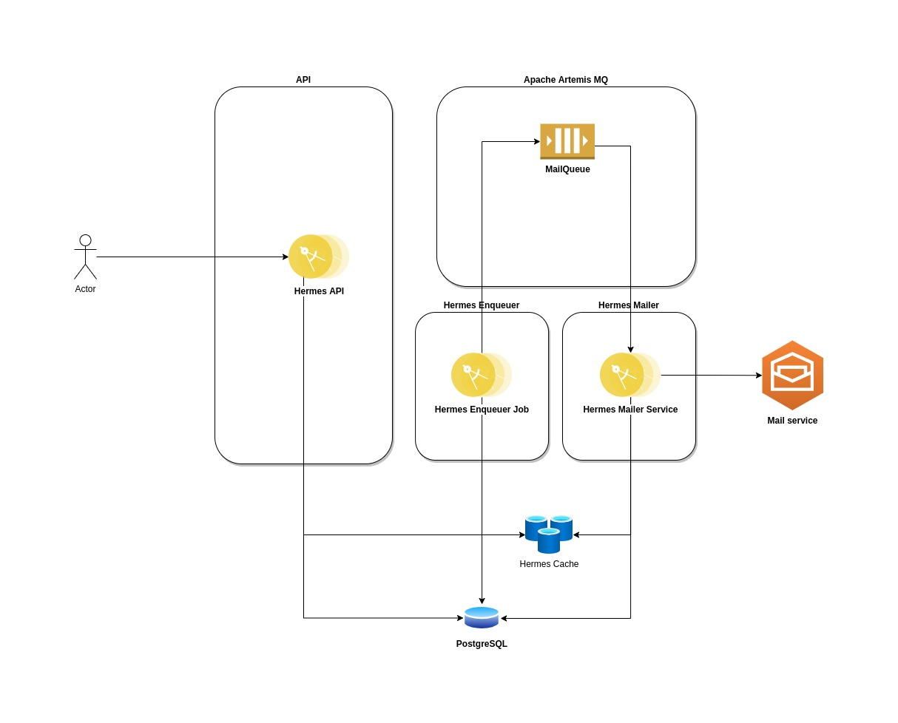

# hermes

O Hermes é um sistema de envio de notificações baseado em eventos.
A idéia é que uma requisição de envio de notificação seja feita na API que criará o modelo de mensagem e enviará um evento para o consumidor que enviará a mensagem para cada endereço de e-mail requisitado.



A idéia é a requisição chegar através do Hermes API onde será armazenada em um banco de dados (PostgreSQL).
Um job irá rodar de tempo em tempo definido na classe `br.com.saulocn.hermes.mailer.batch.MailEnqueuerJob` do Hermes Mailer através da anotação `@Scheduled(every = "2m")`, onde representa que o job será executado a cada 2 minutos. Este job é responsável por ler todas os destinatários de e-mails da tabela `hermes.recipient` que não foram processados (flag `recipient_processed`) e, colocar na fila JMS `jms.queue.MailQueue`.

Cada uma dessas mensagens será processada pelo método `br.com.saulocn.hermes.mailer.service.MessageService#mailConsumer` que obterá a mensagem que deverá ser enviada e enviará ao destinatário. Caso haja qualquer falha, a mensagem retornará para a fila para ser processada numa retentativa.

A fila é programada para ter 10 retentativas a cada 2 minutos:

```
              <max-delivery-attempts>10</max-delivery-attempts>
              <redelivery-delay>120000</redelivery-delay>
```

Referências:
https://quarkus.io/guides/rest-json
https://quarkus.io/guides/datasource
https://quarkus.io/guides/amqp
https://github.com/quarkiverse/quarkus-jberet
https://activemq.apache.org/components/artemis/documentation/latest/
https://hub.docker.com/_/postgres

Imagem do Artemis:
https://github.com/saulocn/dockerlands